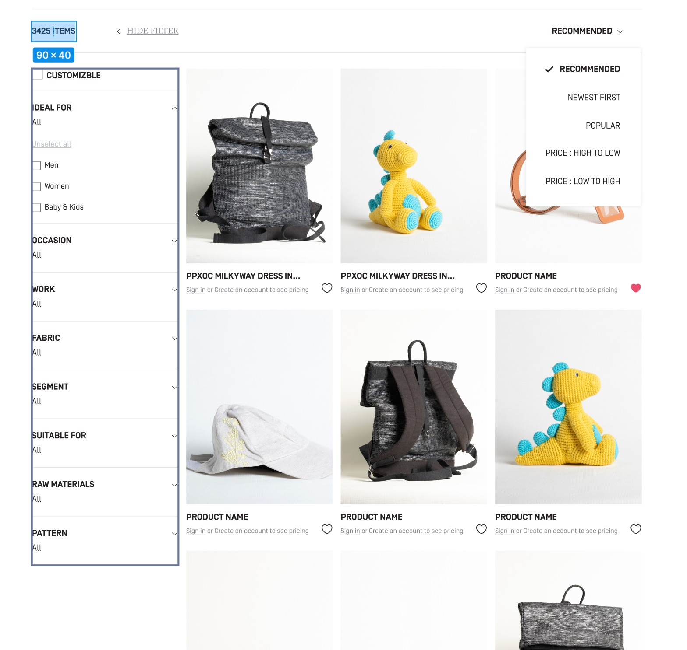
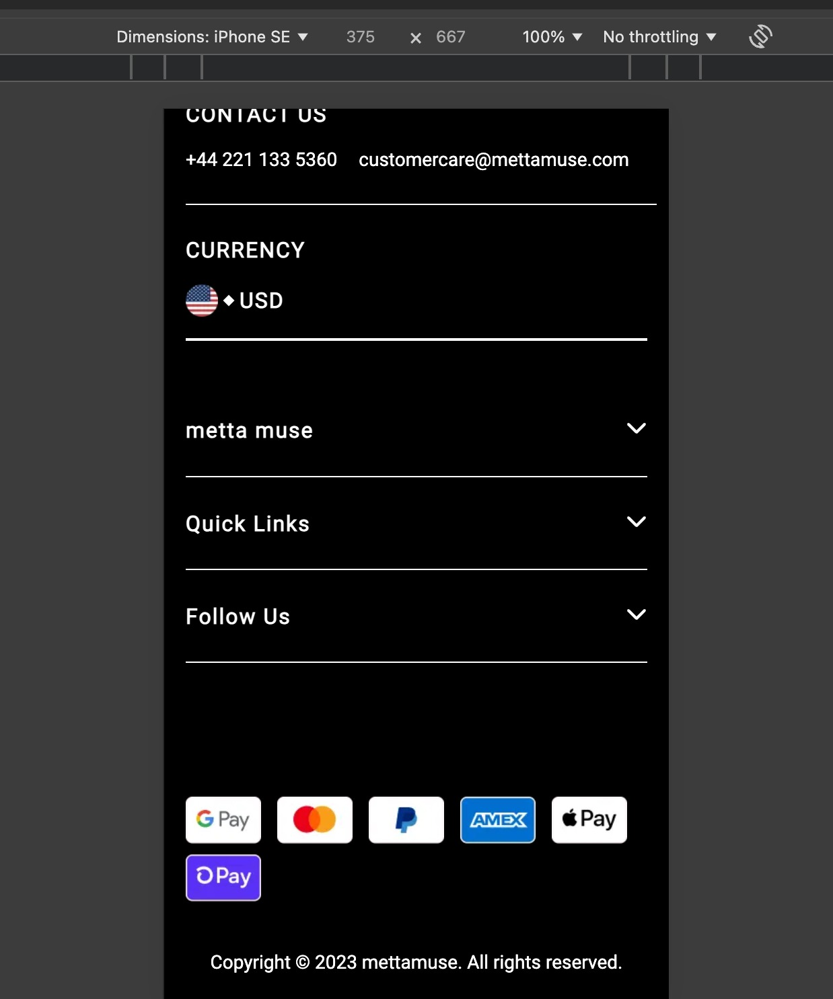

## Overview
The task has been developed using **React.js** with the **Next.js** framework, showcasing my skills in building responsive and SEO-friendly web pages.

## Live Demo
The application is hosted on  for easy access and evaluation.

## Features
- **Server-Side Rendering (SSR):** The application utilizes SSR to enhance performance and SEO.
- **Responsive Design:** The layout is optimized for mobile and tablet devices, ensuring a seamless user experience across different screen sizes.
- **SEO Optimization:** 
  - Configured page title and description.
  - Proper usage of H1 and H2 tags.
  - Implemented schema settings for improved search visibility.
  - Used images with SEO-friendly names and appropriate alt text.
- **Mock API Integration:** Data is fetched from [Fake Store API](https://fakestoreapi.com/) to demonstrate dynamic content rendering.
- **Minimal Dependencies:** The project employs minimal pre-built JavaScript packages for efficiency.

## Structure
- The project follows a modular structure, promoting maintainability and scalability. Code quality is prioritized with clear naming conventions.

## Deployment
You can deploy this project on Netlify, Vercel, or any other static hosting service by following the respective deployment steps.

## SEO Settings
- The project includes the following SEO optimizations:

- Page Title: Defined for better search engine visibility.

- Meta Description: Helps with indexing and provides a summary of the page.

- H1 and H2 tags: Proper usage of heading tags for content structure.

- Schema Settings: Implemented to improve search visibility and understanding.

- Image Optimization: Used descriptive, SEO-friendly image names and appropriate alt text for all images.

## Technologies Used
- React.js with Next.js

- CSS3 for styling

- Fake Store API for mock data integration

- Server-Side Rendering (SSR)

- Responsive Design

## Conclusion
Thank you for reviewing my submission. I look forward to your feedback!

## Web Page Screenshots
**1.**
 **Home Page**
   - This project features a clean and responsive homepage that includes a logo, a navigation bar with links to various sections (Shop, Skills, Stories, About, and Contact Us), and a central section that highlights products with the heading "Discover Our Products". The products are displayed in a grid format, with a sidebar that allows users to apply customizable filters. The design prioritizes user-friendliness and accessibility, ensuring a seamless experience across devices.
   
 

 ---

**2.**  

---

**3.**
 

 ---
 

**4.**
 

 ---

**5.** 

---

**6.** 
**Customizable Product Filter:**
- The filter system allows users to sort products by category such as Men, Women, and Baby & Kids. Selecting a category will display only the relevant products while selecting "All" will reset the filters and show all available products. This flexible filter enhances the user experience by offering tailored product views.

 

 ---

**7.** 
**Sort Products by Preference:**
- The sorting options include filters to organize products by Recommended, Newest First, Popular, Price from High to Low, and Price from Low to High. These features allow users to customize their product browsing experience based on personal preferences or purchase priorities.

 

---

**8.** 

---

**9.** 
**Product Listing Overview:**
- A curated product listing page showing items sorted by price from high to low, featuring three main products: a premium Samsung 49-inch curved gaming monitor, a John Hardy designer silver bracelet, and an Acer budget-friendly monitor. The interface includes filtering options for customization, ideal recipient, and occasion, with 20 total items available for browsing.
  
 

 ---
 

**10.** 
**Men's Category Products:**
    - A filtered view of men's fashion items showcasing three essential products: a Fjallraven laptop backpack in navy blue, a casual baseball-style henley t-shirt in white/black, and a khaki cotton jacket. The selection demonstrates a range of men's accessories and clothing options with clear category filtering applied.
      

---
    

**11.** 
**Footer Layout Description:**
    - A filtered view of men's fashion items showcasing three essential products: a Fjallraven laptop backpack in navy blue, a casual baseball-style henley t-shirt in white/black, and a khaki cotton jacket. The selection demonstrates a range of men's accessories and clothing options with clear category filtering applied.
      

--- 

## Mobile-Responsive E-commerce Pages
   - An elegantly designed mobile-responsive e-commerce layout showcasing three main product listing views: high-end electronics/accessories, men's fashion collection, and a detailed footer section. Each page adapts smoothly to mobile screen sizes, featuring clear category filters, product cards with ratings, and a user-friendly navigation system with full payment and contact information accessible at the bottom.

**Mobile View(IPad Mini)**

**12.** 

---

**13.** 

---

**14.** 

---

**15.** 

---

**Mobile View(IPhone SE)**

**16.** 

---

**17.** 

---

**18.** 

  

